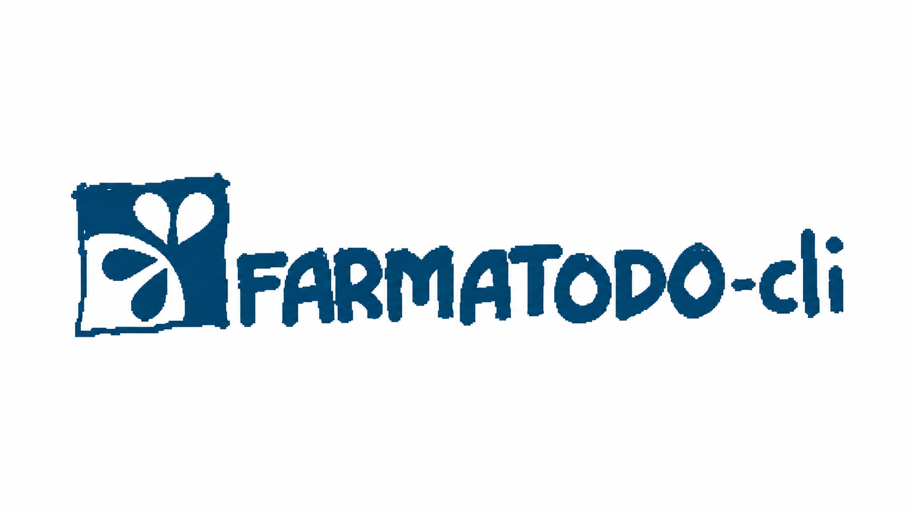
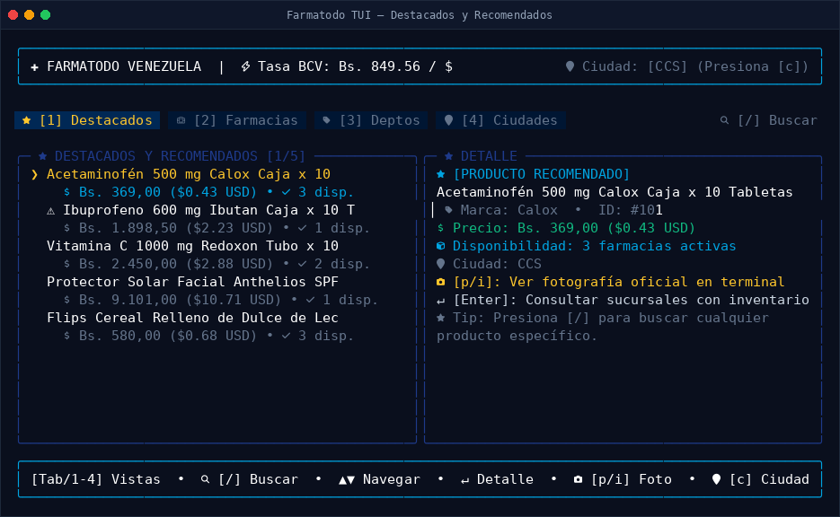

<p align="center">
  
</p>

# Farmatodo CLI & TUI 💊🇻🇪

Interfaz de terminal interactiva (TUI) y cliente CLI para consultar productos, precios en Bolívares y Dólares con la tasa oficial BCV, disponibilidad por sucursales e imágenes de **Farmatodo Venezuela**.



---

## 🚀 Inicio Rápido

### Requisitos
- [Bun](https://bun.sh) (v1.0+)

### Instalación y Ejecución

```bash
# Instalar dependencias
bun install

# Iniciar la interfaz TUI
bun start
```

### Compilar binario nativo independiente
```bash
bun run build
./dist/farmatodo
```

---

## ⌨️ Controles en la TUI

| Tecla | Acción |
|---|---|
| `[Tab]` / `[1-5]` | Alternar vistas: Catálogo, Ofertas, Farmacias, Departamentos, Ciudades |
| `[↑]` / `[↓]` | Desplazarse por la lista |
| `[/]` | Búsqueda interactiva de productos |
| `[Enter]` | Ver detalle completo del producto y sucursales con stock |
| `[p]` / `[i]` | Ver fotografía oficial ampliada |
| `[o]` | Abrir imagen en navegador web |
| `[c]` | Cambiar ciudad activa (Caracas, Valencia, Maracaibo, etc.) |
| `[q]` / `[Esc]` | Volver / Salir |

---

## ⚡ Comandos CLI

Para consultar directamente desde la consola o en scripts:

```bash
# Consultar todas las promociones y ofertas con descuento activo
farmatodo ofertas

# Ver las campañas y grupos destacados de ofertas (Higiene, Dulces, etc.)
farmatodo ofertas --campanas

# Filtrar ofertas por grupo promocional específico
farmatodo ofertas -g 9837

# Buscar productos en general (o filtrar solo los que tienen descuento)
farmatodo buscar "galleta"
farmatodo buscar "rosal" --ofertas

# Consultar la tasa oficial BCV del día
farmatodo tasa

# Consultar disponibilidad de un producto por farmacias
farmatodo stock 111694893 -c CCS

# Listar farmacias en una ciudad
farmatodo farmacias -c CCS
```

---

## 🧪 Pruebas y Validación Visual

```bash
# Ejecutar suite de pruebas
bun test

# Regenerar capturas visuales de todas las vistas en .screenshots/
bun run screenshot
```

---

## 📄 Licencia

MIT. Proyecto no oficial con fines educativos y de utilidad comunitaria.
